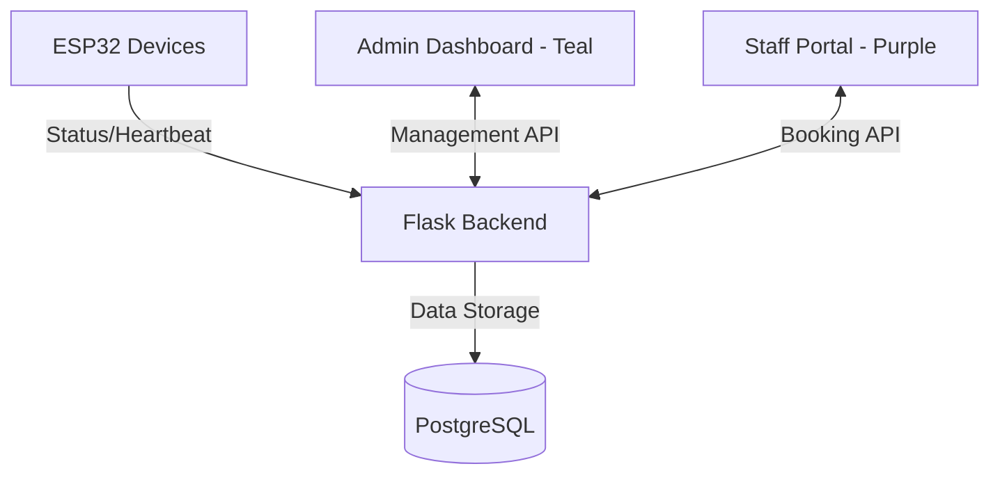

# Smart Classroom Tracker - Project Documentation

## Project Overview
The Smart Classroom Tracker is a comprehensive ecosystem designed to monitor classroom occupancy and automate power management using ESP32 devices, a Python Flask backend, and dual-themed React frontends.

## System Architecture



### Components
1. **Backend**: Flask API with JWT authentication and SQLAlchemy ORM.
2. **Database**: PostgreSQL for persistent storage of users, classrooms, devices, and logs.
3. **Admin Frontend**: Teal-themed glassmorphic interface for system management.
4. **Staff Frontend**: Purple-themed glassmorphic interface for bookings and status viewing.
5. **ESP32 Firmware**: Logic for occupancy sensing (PIR/Ultrasonic) and relay control.

---

## Design Identity

The system uses a high-contrast design system featuring:
- **Glassmorphism**: Translucent panels with backdrop blurs.
- **Ambient Effects**: Animated background orbs and shimmer particles.
- **Mesh Spheres**: Large glowing wireframe spheres providing visual depth.

### Distinct Visual Themes
| Module | Theme Color | Iconography | Purpose |
| :--- | :--- | :--- | :--- |
| **Admin Panel** | 🔵 **Teal/Cyan** | `#22d3ee` | Management, Device Tracking, User Control |
| **Staff Portal** | 🟣 **Purple/Violet** | `#a78bfa` | Room Bookings, Dashboard, Feedback |

---

## Recent Implementations

### 📡 Real-time Device Tracking (Solved)
The system now tracks actual ESP32 connectivity status:
- **Heartbeat System**: Devices send a lightweight signal every 60 seconds.
- **Auto-Computation**: Backend automatically determines "Online" status if a device has been seen in the last 2 minutes.
- **Visual Feedback**: Pulsing indicators (online/offline) in the Admin Dashboard.

### 🎨 Background Overhaul
Replaced static backgrounds with dynamic CSS-only effects:
- Three animated mesh spheres float behind the glass layers.
- Grid-dot patterns provide a technical, modern aesthetic.

---

## Implementation Plan (Current Phase)

### Phase 1: Core Connectivity (Completed)
- [x] Basic JWT Authentication.
- [x] Classroom and Device registration.
- [x] Status reporting from ESP to Backend.

### Phase 2: User Experience (Completed)
- [x] Full Glassmorphism UI redesign.
- [x] Automated color-coding for Admin/Staff distinctions.
- [x] Relative time calculation for "Last Seen" device status.

### Phase 3: Advanced Control (In Progress)
- [ ] Direct manual overrides for classroom power via Admin UI.
- [ ] Advanced scheduling logic based on classroom bookings.
- [ ] Push notifications for device disconnection events.

---

## Deployment Quick-Start

The entire ecosystem is containerized for easy deployment:

```bash
# Build and start all services
docker-compose up -d --build

# Backend logs for debugging
docker logs classroom_api -f
```

**Service URLs:**
- Admin Panel: `http://localhost:8092`
- Staff Portal: `http://localhost:8091`
- API Backend: `http://localhost:8089`

---

## Connecting an ESP32 Device

### Option A — Real ESP32 Hardware

1. **Register the device** in Admin Panel → Devices → **+ Register Device**.
   - Set Device ID (e.g. `CLASSROOM_001`), click **Generate** for the API key.
2. **Find your PC's LAN IP** — run `ipconfig` (Windows) or `hostname -I` (Linux).
3. **Edit the firmware** (`esp-firmware/esp_classroom_node.ino`):
   ```cpp
   const char* WIFI_SSID     = "YourWiFiName";
   const char* WIFI_PASSWORD  = "YourWiFiPassword";
   const char* SERVER_URL     = "http://<YOUR_PC_IP>:8089";
   const char* DEVICE_ID      = "CLASSROOM_001";
   const char* API_KEY        = "<paste key from step 1>";
   ```
4. **Flash** via Arduino IDE → Board: ESP32 Dev Module → Upload.
5. Open Serial Monitor (115200 baud) — you'll see status reports being sent.

> **Important**: The ESP cannot reach `localhost`. Use your PC's LAN IP. Both devices must be on the same network.

### Option B — Python Simulator (No Hardware)

Simulates an ESP device from any Linux/Windows machine:

```bash
# Install dependency (once)
pip install requests

# Run the simulator
python esp-firmware/simulator.py \
  --url http://localhost:8089 \
  --device-id CLASSROOM_001 \
  --api-key <paste key from admin panel>
```

The simulator sends status reports every 30 seconds. Open the Admin Panel → **Devices** page to see the device go **Online** with a pulsing green dot. Press `Ctrl+C` to stop — the device will show **Offline** after ~2 minutes.

### Troubleshooting
| Problem | Solution |
|---|---|
| `Connection refused` | Backend not running. Run `docker-compose up -d --build` |
| `AUTH FAILED (401)` | Device ID or API key mismatch. Re-check in Admin → Devices |
| ESP can't reach server | Use LAN IP, not `localhost`. Check firewall allows port 8089 |
